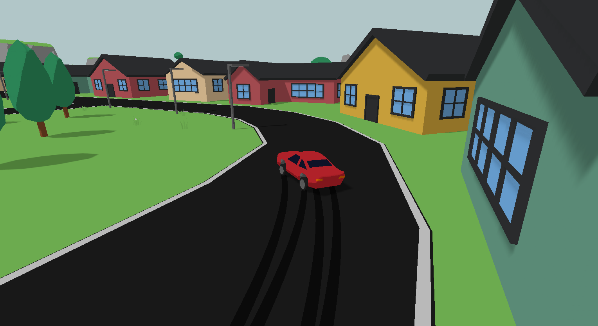

# Car Game



A physics-based car sandbox in your browser, built on WebGL/WASM with Rust. Graphics and assets are homemade.

## Building

### Build Requirements

- Make
- Cargo/Rust
- Typescript (tsc)

### Development build

```sh
make build

# Basic test web server
make serve
```

### Release build

```sh
make build-release
```

Build output is placed in `./dist`


## TODO

- Particles
- Sound
- More map features
	- Hitboxes
	- Farm
	- Soccer field
	- Clouds
- Tune controls/physics